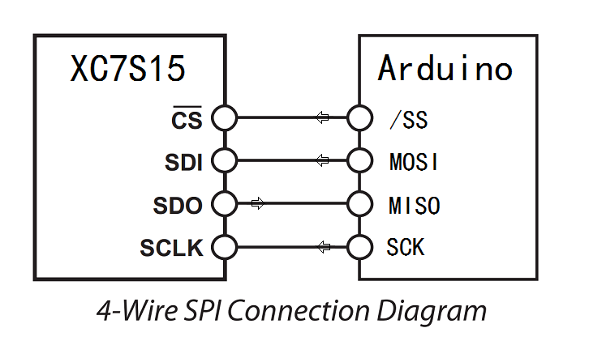

SPI2GPIO project
==================

  This is a sample FPGA project for Spartan Edge Accelerator Board conjunction with Arduino(UNO).  
  Provide GPIO/UART/ADC/DAC/RGB-LED functions, communication with Arduino(UNO) through SPI interface.

  
FPGA & Arduino(UNO) Connections
-------------------------------

  
Generate bitstream
------------------
  Install Xilinx Vivado on Windows,
  put the bin path of vivado into SYSTEM PATH,
  then run build.cmd.

  
Load bitstream to FPGA
----------------------
  Click [here](https://github.com/sea-s7/spartan-edge-esp32-boot)

  
SPI Registers
-------------
<pre>
  * 0x0C  - GPD_OE    port D output enable, 1 for output, 0 for input
  * 0x0D  - GPD_ODATA port D output data
  * 0x0E  - GPD_IDATA port D input  data
  * 0x0F  - GPD_ALT   port D alternate function control,
            bit 0x3F  reserved
            bit 0x40  I2C_SDA alternate, 1 for I2C_SDA, 0 for GPORT_D[6]
            bit 0x80  I2C_SCL alternate, 1 for I2C_SCL, 0 for GPORT_D[7]
</pre>

  
Arduino(UNO) Demo
-----------------
This demo code run on Arduino(UNO), control the IO ports of FPGA(xc7s15).  
see [FPGAPortControl.ino](FPGAPortControl/FPGAPortControl.ino)

  
More Materials
--------------
  Click [here](detailed.md)
